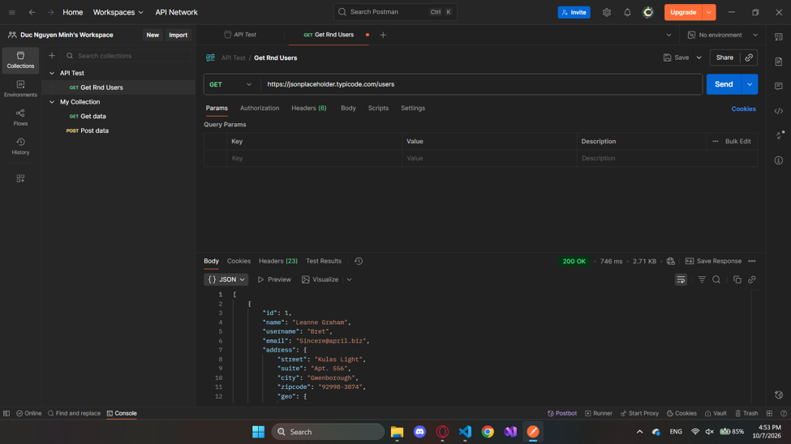
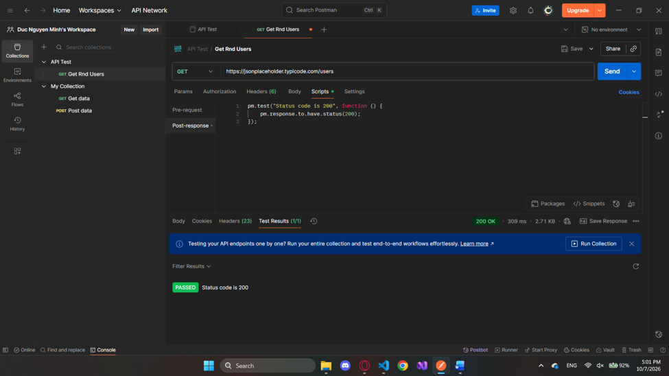
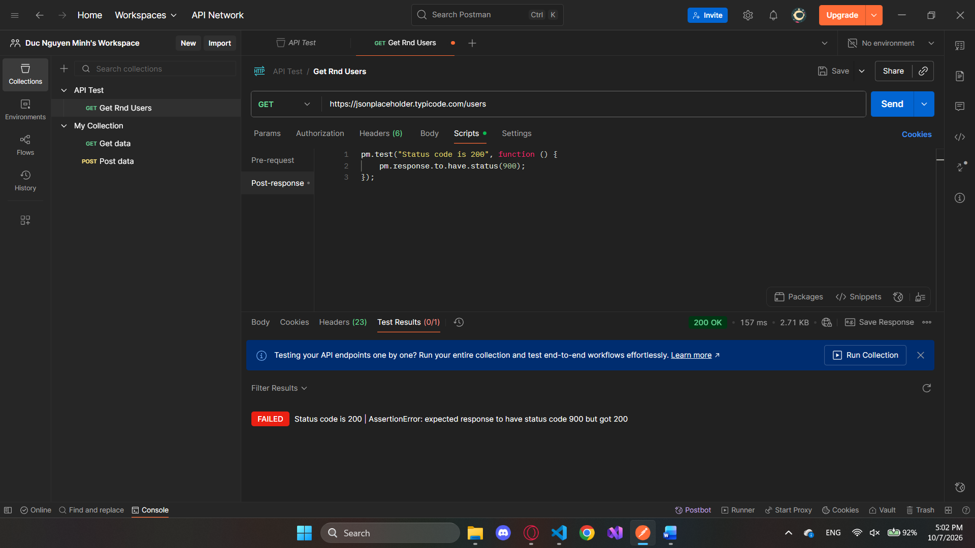
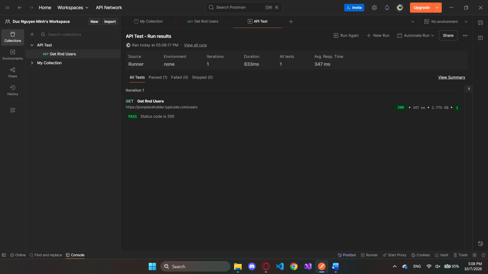

# BÁO CÁO THỰC HÀNH LAB 7: KIỂM THỬ API VỚI POSTMAN

* **Môn học:** Đánh giá & Kiểm thử phần mềm
* **Họ và tên:** Nguyễn Minh Đức
* **MSSV:** 23010171
* **Công cụ sử dụng:** Postman Desktop App, JSONPlaceholder API, GitHub

---

## 1. Giới thiệu tổng quan
Bài thực hành hướng dẫn làm quen với quy trình kiểm thử giao diện lập trình ứng dụng (API) bằng công cụ Postman:
- Khởi tạo Collection và cấu hình Request theo phương thức `GET`.
- Phân tích cấu trúc phản hồi từ API: Mã trạng thái HTTP (Status Code), thời gian phản hồi (Response Time), và định dạng dữ liệu trả về (JSON).
- Xây dựng các đoạn mã kiểm thử tự động (Assertions) bằng ngôn ngữ JavaScript trên Postman.
- Thực thi tự động toàn bộ bộ kiểm thử thông qua công cụ Collection Runner.

---

## 2. API sử dụng để kiểm thử
- **Endpoint:** `[https://jsonplaceholder.typicode.com/users](https://jsonplaceholder.typicode.com/users)`
- **Phương thức:** `GET`
- **Mục đích:** Lấy danh sách thông tin người dùng từ máy chủ công khai.

---

## 3. Các bước thực hiện & Kết quả minh chứng

### 3.1. Gửi Request GET thành công
Thực hiện gửi phương thức `GET` đến endpoint `/users`. Máy chủ phản hồi thành công mã trạng thái `200 OK` cùng danh sách dữ liệu người dùng định dạng JSON.



---

### 3.2. Viết mã kiểm thử tự động (Post-response Scripts)
Sử dụng thư viện `pm` tích hợp sẵn trong Postman để xác minh phản hồi trả về đúng mã trạng thái `200`:
```javascript
pm.test("Status code is 200", function () {
    pm.response.to.have.status(200);
});
```



---

### 3.3. Kết quả kiểm thử thành công (Test Passed)
Sau khi gửi lại request, kiểm tra tại tab **Test Results**, kết quả hiển thị `PASS: Status code is 200` với tỷ lệ đạt 1/1.


---

### 3.4. Thử nghiệm trường hợp kiểm thử thất bại (Test Failed)
Để chứng minh khả năng bắt lỗi của assertion, điều chỉnh mã mong đợi sang `900`. Kết quả báo lỗi `FAIL` do mã phản hồi thực tế `200` không trùng khớp với giá trị kỳ vọng `900`.



---

### 3.5. Chạy tự động Collection Runner
Khôi phục lại mã kiểm thử về `200`, lưu cấu hình và sử dụng tính năng **Run collection** để kiểm thử tự động toàn bộ request trong thư mục.



---

## 4. Kết luận
- Nắm vững quy trình cấu hình, gửi và phân tích dữ liệu trả về của API trên Postman.
- Hiểu và áp dụng được các cú pháp assertion cơ bản để tự động hóa việc xác thực dữ liệu API.
- Xuất dữ liệu Collection sang tệp JSON phục vụ lưu trữ và tích hợp quy trình kiểm thử phần mềm.
